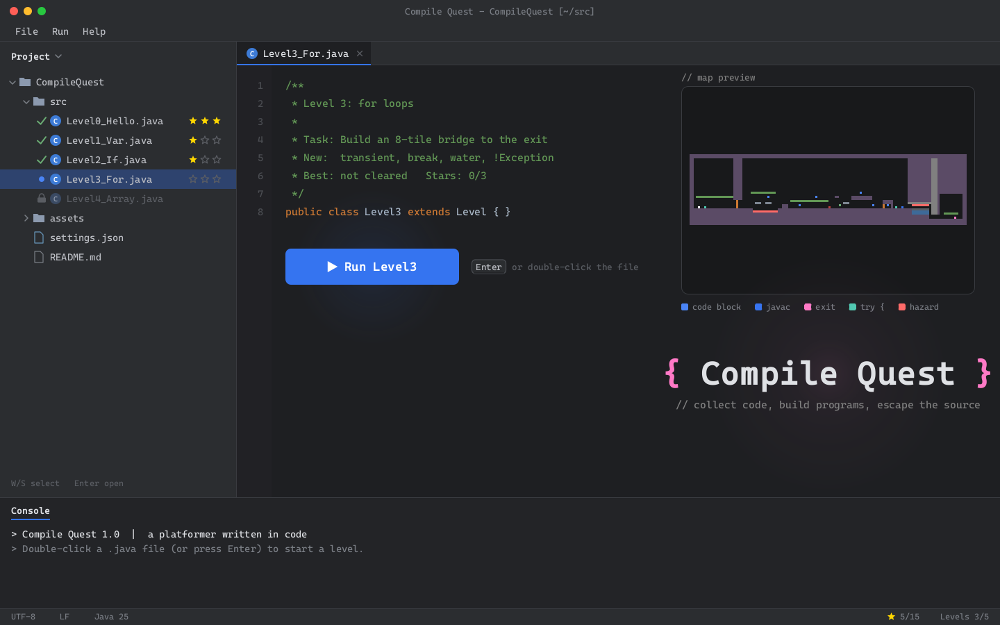
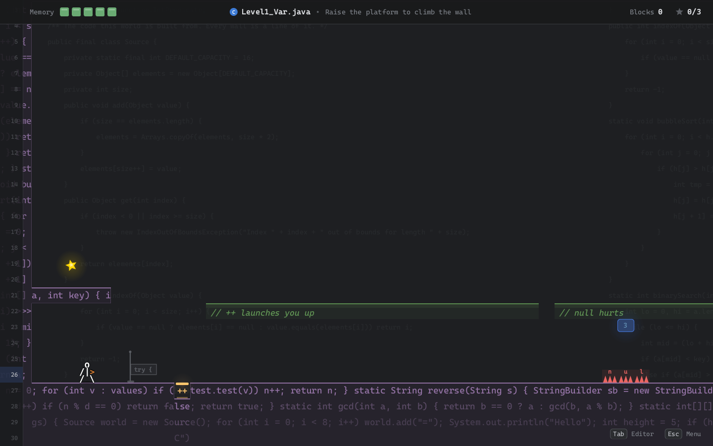
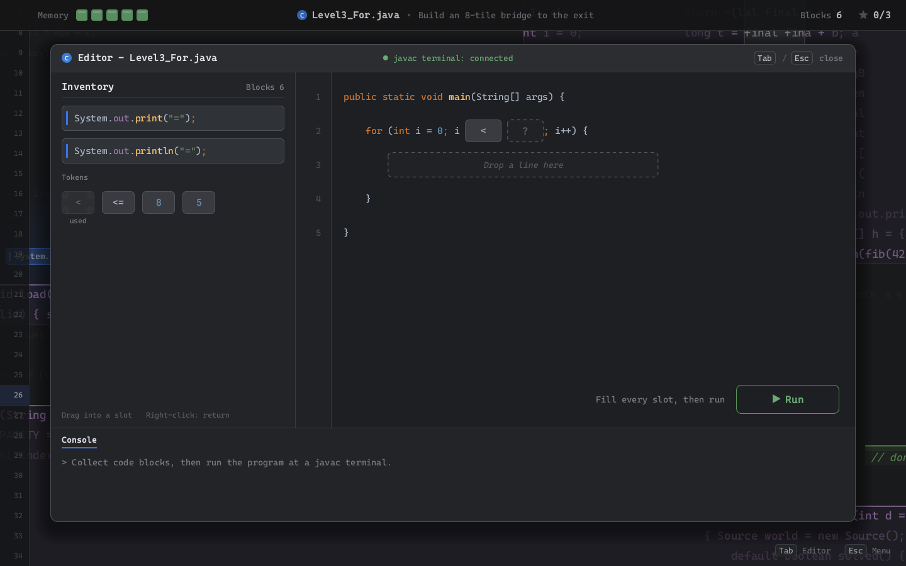
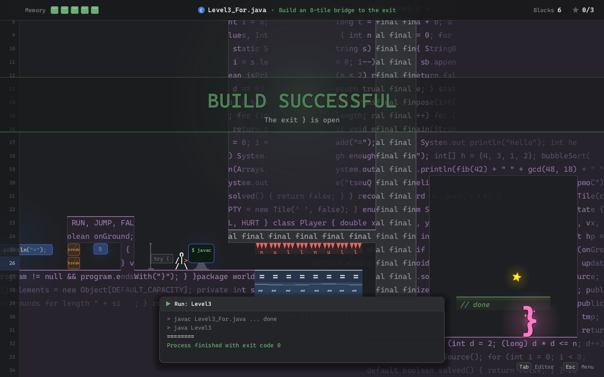
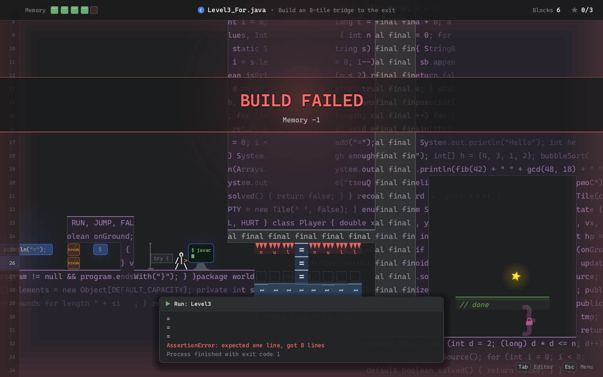
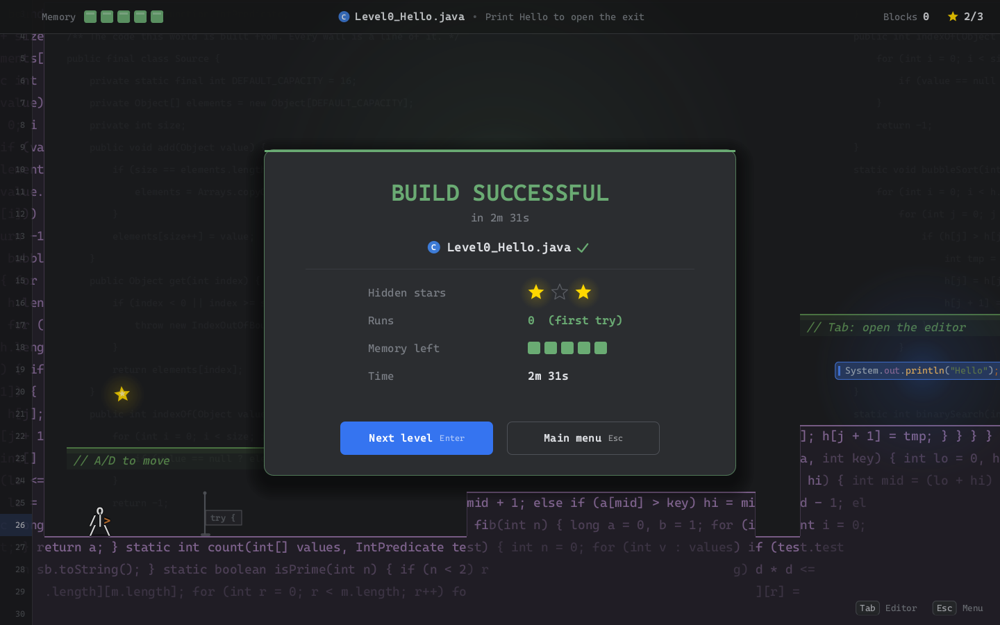

# Compile Quest

一个用纯 Java（Swing / Java2D，无第三方库）编写的横版跳跃 + 代码拼装解谜游戏。

整个世界由代码构成：墙是真实的源码，单向平台是 `// 注释`，弹簧是 `++`，尖刺是 `null`。玩家在关卡里收集代码块，在编辑器里把它们拼成完整的 Java 程序，然后到 `javac` 终端运行。**程序的输出会改变地图**：打印出 8 个 `=` 就生成一座 8 格的桥，排序算法会把柱子排成阶梯。拼错的程序会扣 1 格 Memory（血量），并把错误的后果演出来。

设计细节见 [DESIGN.md](DESIGN.md)。

| 主菜单 | 关卡 |
|---|---|
|  |  |
| **编辑器（拖拽拼装）** | **运行成功** |
|  |  |
| **运行失败** | **通关** |
|  |  |

---

## 运行

需要 **JDK 17 或更新版本**（本机已装 JDK 25）。

**方式一：直接运行（推荐）**

双击 `run.bat`。第一次运行会自动编译并生成 `CompileQuest.jar`，之后直接启动。

**方式二：命令行**

```bat
build.bat
java -jar CompileQuest.jar
```

macOS / Linux 用 `sh build.sh`。

**方式三：VS Code**

1. 安装插件 **Extension Pack for Java**（Microsoft 出品）。
2. 用 VS Code 打开 `JAVA_Project` 文件夹。
3. 按 F5，选择 **Compile Quest**。`launch.json` 里还配置了直接进入某一关、地图检查等调试项。

**方式四：Eclipse**

File → Import → General → Existing Projects into Workspace，选择本文件夹，然后运行 `com.compilequest.Main`。

---

## 操作

| 按键 | 作用 |
|---|---|
| A / D（或 ← →） | 左右移动 |
| W / Space（或 ↑） | 跳跃，长按跳得更高；在空中再按一次是二级跳 |
| S（或 ↓） | 从 `// 注释` 平台上落下去 |
| 鼠标左键 / J | 朝面向的方向射出 `->` 箭 |
| E | 在 `javac` 终端旁：打开编辑器并可以运行 |
| Tab | 随时打开 / 关闭编辑器（不在终端旁时只能拼装，不能运行） |
| Esc | 暂停菜单 |
| R | 重开本关 |
| F1 | 调试面板（碰撞箱、速度、实时调整手感参数） |
| **编辑器内** | 鼠标拖拽代码块进空槽；拖到已有块的空槽上会交换；右键把块退回背包；双击背包里的块自动放入第一个合适的空槽 |

---

## 关卡

| 关 | 文件 | 知识点 | 程序运行后的效果 | 新元素 |
|---|---|---|---|---|
| 0 | `Level0_Hello.java` | `main` + `println` | 打印 Hello，出口打开 | 注释平台、二级跳、javac 终端、编辑器 |
| 1 | `Level1_Var.java` | `int` 变量，数字与字符串 | 升降台升到 `height` 格高 | `++` 弹簧、`null` 尖刺、`gc()` |
| 2 | `Level2_If.java` | `if / else` | 拿着钥匙时开门，否则触发警报刷出 Bug | Bug、射箭、`try {` 存档点、`true` 钥匙 |
| 3 | `Level3_For.java` | `for` 循环，`<` 和 `<=`，`print` 和 `println` | 逐格打印出一座桥 | `transient`、`break`、水、`!Exception` |
| 4 | `Level4_Array.java` | 数组 + 冒泡排序，数组越界 | 柱子按冒泡过程两两交换，排成阶梯 | `volatile`、`while(true)` 移动平台、`final` |

每关藏有 3 颗隐藏星星。进度、星星和最佳用时保存在运行目录下的 `save.json`。

---

## 项目结构

```
JAVA_Project/
├── src/com/compilequest/
│   ├── Main.java                 入口（以及开发者工具的命令行开关）
│   ├── core/                     游戏循环、窗口、输入、音效合成、JSON、存档、绘图工具、主题
│   ├── world/                    TileMap（地形与渲染缓存）、TileType、Camera
│   ├── entity/                   Player（物理）、PlayerAnimator（字符动画）、Bug、Exception、箭、道具、粒子…
│   ├── editor/                   EditorOverlay（拖拽编辑器）、BlockDef、Syntax（语法高亮）
│   ├── level/                    LevelScreen、LevelConfig、LevelLoader、Judge（判定）、Effects、RunSequence、Hud
│   ├── ui/                       MenuScreen（仿 IDE 主菜单）、暂停 / 死亡 / 通关 / 设置 / 确认框
│   └── dev/                      MapCheck、FlowCheck、Snapshot（开发者工具，见下）
├── res/
│   ├── levels/levelN.txt         关卡地图（字符画）
│   ├── levels/levelN.json        关卡配置：代码块、程序骨架、空槽、每种拼法的结果
│   └── text/wall.txt             填充墙体的源码文本
├── tools/make_maps.py            生成关卡地图的脚本（可选）
├── docs/screenshots/             截图
├── build.bat / run.bat / build.sh
├── DESIGN.md                     设计文档
└── CompileQuest.jar              构建产物
```

---

## 修改或新增关卡

关卡完全由数据驱动，不需要改 Java 代码：

1. 在 `res/levels/levelN.txt` 里用字符画地图（字符含义见 DESIGN.md 第 5.1 节和第 8.2 节）。
2. 在 `res/levels/levelN.json` 里写代码块、程序骨架、空槽和每种拼法的结果（格式见 DESIGN.md 第 8.3 节，可以照着现有关卡改）。
3. 运行地图检查，确认所有代码块、终端都够得着，运行成功后出口能到达：

```bat
java -cp CompileQuest.jar com.compilequest.Main --mapcheck
```

`levelN.json` 写错时，游戏启动会给出具体的错误提示（例如引用了不存在的代码块）。

---

## 开发者工具

| 命令 | 作用 |
|---|---|
| `java -cp CompileQuest.jar com.compilequest.Main --mapcheck` | 用真实的玩家物理（走、跳、二级跳、下落）检查每关的代码块、终端、出口是否可达；确认不写对程序就到不了出口，以及运行失败后还能回到终端（不会卡关） |
| `java -cp CompileQuest.jar com.compilequest.Main --flowcheck` | 自动跑一遍主要流程：每关每种拼法的运行结果、编辑器拖拽 / 交换 / 退回、死亡复活、通关存档 |
| `java -cp CompileQuest.jar com.compilequest.Main --snapshot build/snapshots` | 不开窗口，把各个界面渲染成 PNG（用于检查画面、写报告） |
| `java -Dcq.level=3 -jar CompileQuest.jar` | 跳过菜单直接进入第 3 关 |
| 游戏中按 F1 | 调试面板：`[` `]` 选择参数，`-` `=` 实时调整跳跃高度、重力等手感参数 |

---

## 常见问题

- **中文输入法会不会拦截 WASD？** 不会。游戏窗口禁用了输入法，开着中文输入法也能直接操作。
- **全屏 / 窗口切换、音量**：主菜单选中 `settings.json`，或在游戏中按 Esc → Settings。
- **重置进度**：设置里的 `resetSave`，或者直接删除 `save.json`。
- **性能**：游戏针对软件渲染做了优化（静态地形分块缓存、发光和阴影预渲染），在 200% 缩放的 2880×1800 屏幕上约 60 FPS。显卡支持 OpenGL 的电脑可以尝试 `java -Dsun.java2d.opengl=true -jar CompileQuest.jar`。
- **字体**：自动选用已安装的 JetBrains Mono / Cascadia Mono / Consolas。想统一字体，可以把 `JetBrainsMono-Regular.ttf`、`JetBrainsMono-Bold.ttf`、`JetBrainsMono-Italic.ttf` 放进 `res/fonts/` 后重新构建。
- **音效**：所有音效在启动时用代码合成，没有音频文件。
